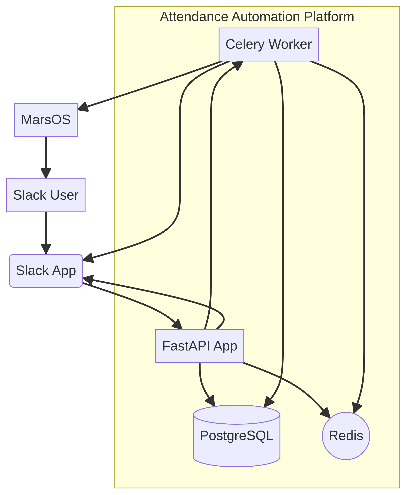

# Slack to MarsOS Attendance Automation Platform

This project implements a production-ready attendance automation platform that integrates with Slack and MarsOS. Employees report their workday start by posting a structured message in a designated Slack channel, which triggers an automatic attendance timer in MarsOS.

**Important Note on Deployment:** This platform is designed as a **server-side solution**. This means the application runs on a central server (e.g., a cloud instance or your company's infrastructure), and employees **do not need to install any software** on their individual machines to use it. Their interaction is solely through Slack.

## Features

- **Slack Integration**: Listens to Slack Events API for specific messages in a configured channel or in a DM with the bot.
- **Message Validation**: Validates incoming Slack messages for required keywords and format using regular expressions.
- **Employee Mapping**: Maps Slack users to MarsOS employees using a dedicated database table.
- **Attendance Automation**: Starts and ends attendance in MarsOS automatically via Playwright browser automation.
- **Duplicate Prevention**: Prevents duplicate attendance entries for the same day.
- **Idempotency**: Slack redeliveries are suppressed in Redis and again by a unique `slack_event_id` constraint, so no action is ever performed twice.
- **Comprehensive Logging**: Logs all operations, including Slack events, validation, employee lookups, MarsOS interactions, and errors.
- **Slack Bot Responses**: Provides immediate feedback to employees in Slack regarding attendance status.
- **Security**: Implements robust security measures including secret encryption, Slack signature verification, and input validation.
- **Scalability**: Designed with a modular architecture to support future expansions (e.g., other chat platforms, multiple attendance providers).

## Technology Stack

- **Backend**: Python 3.13+ with FastAPI
- **Server**: Uvicorn
- **Database**: PostgreSQL
- **ORM**: SQLAlchemy 2.x
- **Migrations**: Alembic
- **Configuration**: Pydantic Settings
- **Authentication**: Slack Signing Secret
- **Deployment**: Docker, Docker Compose
- **Logging**: Loguru
- **Task Queue**: Celery with Redis broker
- **Browser Automation**: Playwright
- **Testing**: Pytest
- **Code Quality**: Ruff, Black, Mypy

## Architecture Overview

Below is a high-level overview of the system architecture:



## Project Structure

```
attendance-automation/
├── app/
│   ├── api/                  # FastAPI endpoints
│   ├── services/             # Business logic and service orchestration
│   ├── repositories/         # Database interaction logic
│   ├── models/               # SQLAlchemy models
│   ├── schemas/              # Pydantic schemas for data validation and serialization
│   ├── core/                 # Core configurations, settings, and utilities
│   ├── middleware/           # FastAPI middleware for security, logging, etc.
│   ├── database/             # Database connection, session management, Alembic setup
│   ├── workers/              # Celery tasks
│   ├── playwright/           # Playwright browser automation logic
│   ├── slack/                # Slack API interaction logic
│   ├── marsos/               # MarsOS integration logic (API/Playwright providers)
│   └── utils/                # General utility functions
├── tests/                    # Unit, integration, and end-to-end tests
├── docker/                   # Dockerfile and related configurations
├── scripts/                  # Helper scripts (e.g., for setup, deployment)
├── docs/                     # Project documentation, diagrams
├── README.md                 # Project overview and setup guide
├── docker-compose.yml        # Docker Compose configuration for local development
├── .env.example              # Example environment variables
└── pyproject.toml            # Project metadata and dependencies
```

## Setup and Local Development

To get the project running for local development and testing, follow these steps. Ensure you have **Docker** and **Docker Compose** installed on your machine.

1.  **Clone the repository**:
    ```bash
    git clone https://github.com/your-repo/attendance-automation.git
    cd attendance-automation
    ```

2.  **Environment Variables**: Create a `.env` file by copying `.env.example` and fill in the required values. **These are crucial for the application to function correctly.**
    ```bash
    cp .env.example .env
    ```
    Edit `.env` with your Slack API credentials and MarsOS details. Refer to the `docs/deployment.md` for a detailed explanation of each variable and what needs to be replaced.

3.  **Docker Compose**: Start the services using Docker Compose. This will build the necessary Docker images and bring up the PostgreSQL database, Redis, the FastAPI application, and the Celery worker.
    ```bash
    docker compose up --build -d
    ```
    The `-d` flag runs the containers in detached mode.

4.  **Database Migrations**: Once the services are running, apply database migrations to set up the database schema:
    ```bash
    docker compose exec app alembic upgrade head
    ```

5.  **Access the Application**: The FastAPI application will be accessible at `http://localhost:8000`.
    -   API Documentation (Swagger UI): `http://localhost:8000/docs`
    -   Redoc: `http://localhost:8000/redoc`

## Employee Commands

Employees interact with the platform entirely through Slack, either in the channel
configured as `SLACK_CHANNEL_ID` or in a DM with the bot (unless
`SLACK_ALLOW_DIRECT_MESSAGES=false`).

**Start the workday** — post a report containing a `- Start` line, a `Tasks:`
section, and an `Expected Today:` section:

```
July 13, 2026 - Start

Tasks:
• Task A

Expected Today:
• Goal A
```

**End the workday** — post the command:

```
\end
```

Anything else in the channel is ignored. Bot messages, thread replies, edits, and
deletions never trigger automation.

## Admin API

The `/api/v1/employees` and `/api/v1/attendance` endpoints expose employee records
and accept plaintext MarsOS passwords, so they require an `X-Admin-API-Key` header
matching `ADMIN_API_KEY`. If `ADMIN_API_KEY` is unset these endpoints return `503`
— they are disabled rather than left unauthenticated.

```bash
curl -H "X-Admin-API-Key: $ADMIN_API_KEY" http://localhost:8000/api/v1/employees
```

The Slack webhook authenticates separately, by signature, and needs no admin key.

## Testing the Automation (Local)

To test the MarsOS automation without a full Slack integration setup, you can use the provided helper scripts:

1.  **Seed a Test Employee**: Add a dummy employee to your database.
    ```bash
    docker compose exec app python scripts/seed_data.py
    ```

2.  **Trigger Automation**: Manually trigger the attendance automation for the seeded test employee.
    ```bash
    docker compose exec app python scripts/trigger_automation.py --slack-id U_TEST_123
    ```
    This will simulate a Slack message and attempt to start attendance in MarsOS via Playwright.

## Deployment

For deploying to a production environment, please refer to the `docs/deployment.md` file for detailed instructions, including environment variable management and CI/CD examples.

## Running Tests

The suite is hermetic — it uses an in-memory SQLite database and fakes for Slack,
Redis, Celery, and Playwright, so no services need to be running:

```bash
pytest
```

Or inside the container:

```bash
docker compose exec app pytest
```

## Contributing

Contributions are welcome! Please refer to `CONTRIBUTING.md` (to be created) for guidelines.

## License

This project is licensed under the MIT License. See the `LICENSE` file (to be created) for details.
